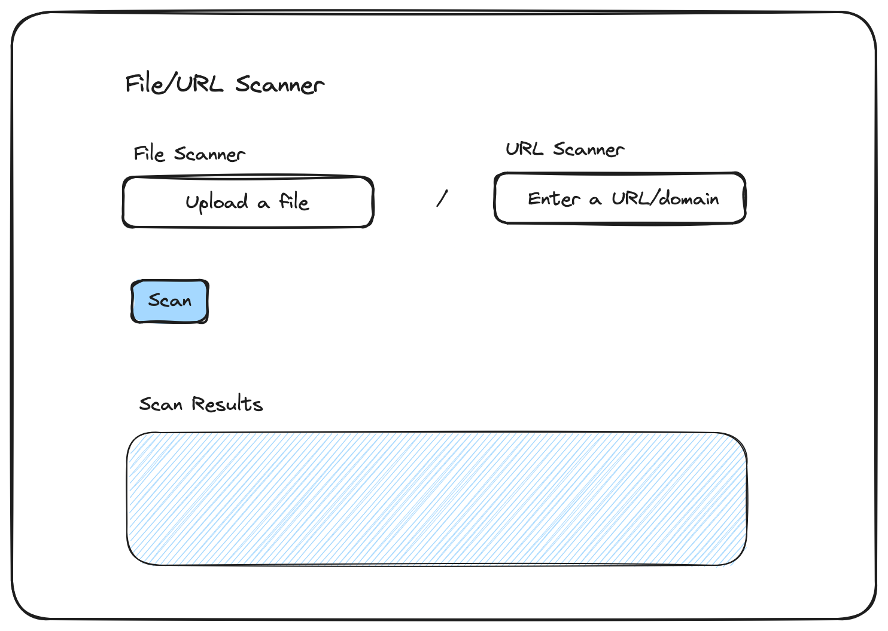

## Objective

Build a security scanner app that allows users to upload files/enter URLs for security scans. The app should integrate third-party APIs to perform scans and present results in an accessible format for both technical and non-technical users. The task will primarily assess your problem-solving and coding skills, knowledge of secure design principles, including supply chain security, and documentation skills.

Feel free to explore creative approaches such as integrating additional services, providing detailed insights using AI/LLM or implementing features that enhance user experience and accessibility.

## Task Description

1. Create app:

   - Build a web app where users can:
     - Upload large files (up to 1-2GB, as you see fit).
     - Enter URLs.
   - The UI should be simple and intuitive for both technical and non-technical users.
   - You can use **Streamlit** to quickly build the UI. This repo already has a Streamlit setup that can be used as a starting point. But feel free to use whatever works for you.

   Here is a UI blueprint for your reference:
   

2. Integrate third-party APIs/tools:

   - Use the free tiers of services such as VirusTotal and urlscan.io to scan files and URLs. You can add the option to allow users to use their own API keys.
   - Feel free to integrate additional services or tools as you see fit.
   - You can also integrate LLMs to add context or descriptions to the scan results; the end goal is to make the results understandable to technical and non-technical users.
   - Be mindful of the limits/quotas imposed by the external services you integrate. You can display the API usage status and any quota limits to users.

3. Security considerations:
   - Ensure the app follows security best practices, especially when handling file uploads and user inputs.
   - Allow users to choose which services to use for scanning. By default all available services may be enabled.
   - Do not upload files to external services without consent from user, instead calculate the hashes and perform lookup by hash as the first step.

### Bonus Points

- Dockerize the application. The existing Dockerfile may not be optimized for production use, so modify it and follow best practices such as layer caching, multi-stage builds, non-root container, etc.
- If you are going to store the files, ensure the files are encrypted at rest on the server side.
- Provide clear documentation for setting up and using the app.
- Identify, fix and document any aspects outside the source code that require attention. There are at least a few places where this applies.

## Deliverables

- A codebase with a functional app, that adheres to secure design principles.
- Instructions for running and deploying the app.
- A summary of your design decisions, API integrations and security considerations. Also mention anything you needed to work on besides the source code.
- Use the file [SOLUTION.md](./SOLUTION.md) for your documentation.

## Resources

- [Streamlit](https://streamlit.io/) - [docs](https://docs.streamlit.io/)
- [VirusTotal](https://www.virustotal.com/) - [API docs](https://docs.virustotal.com/reference/overview)
- [urlscan.io](https://urlscan.io/) - [API docs](https://urlscan.io/docs/api/)
